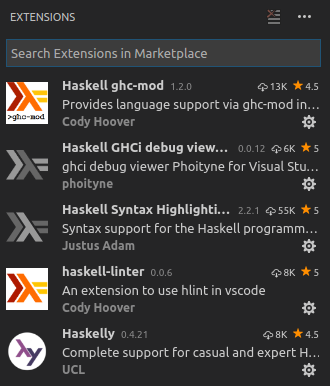
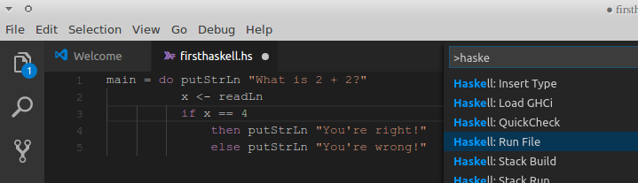
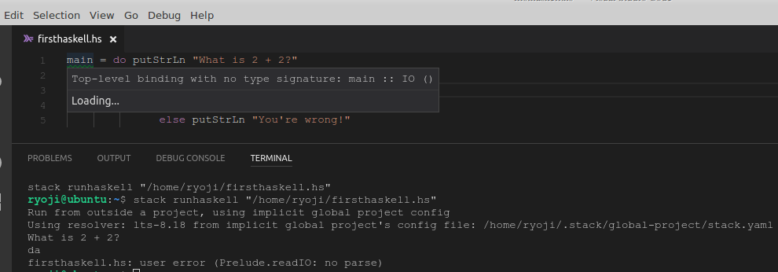
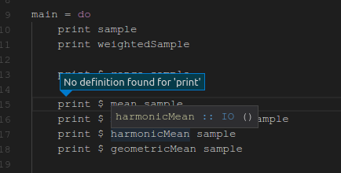

Visual Studio Code + Haskell jump to definition..give up
============================
 * https://github.com/growingspaghetti/hack_the_tower_scala_20170513

Synaptic install haskell-stack

```
$stack setup
Run from outside a project, using implicit global project config
Using resolver: lts-8.18 from implicit global project's config file: /home/ryoji/.stack/global-project/stack.yaml
Preparing to install GHC to an isolated location.
This will not interfere with any system-level installation.
Downloaded ghc-8.0.2.                                      
Installed GHC.                               
stack will use a locally installed GHC
For more information on paths, see 'stack path' and 'stack exec env'
To use this GHC and packages outside of a project, consider using:
stack ghc, stack ghci, stack runghc, or stack exec

$stack upgrade
...
Registering stack-1.4.0...
Completed all 173 actions.
Copying from /tmp/stack-upgrade6391/stack-1.4.0/.stack-work/install/x86_64-linux/lts-6.25/7.10.3/bin/stack to /home/ryoji/.local/bin/stack

Copied executables to /home/ryoji/.local/bin:
- stack

stack install ghc-mod
stack install hlint
stack install phoityne-vscode
stack install intero QuickCheck stack-run
stack install stylish-haskell
```

```
ryoji@ubuntu:~$ which ghc-mod
/home/ryoji/.local/bin/ghc-mod
ryoji@ubuntu:~$ ghc-mod --version
ghc-mod version 5.7.0.0 compiled by GHC 8.0.2
ryoji@ubuntu:~$ stack ghc
ghc: no input files
Usage: For basic information, try the `--help' option.
ryoji@ubuntu:~$ stack ghci
Configuring GHCi with the following packages: 
GHCi, version 8.0.2: http://www.haskell.org/ghc/  :? for help
Loaded GHCi configuration from /tmp/ghci14477/ghci-script
Prelude> :quit
Leaving GHCi.
```

 * https://www.reddit.com/r/haskell/comments/r5dxn/please_critique_my_very_simple_bmi_calculator/
 * https://www.schoolofhaskell.com/school/to-infinity-and-beyond/pick-of-the-week/Simple%20examples 

Ctrl Shift X > Extentions



File > Preferences > Settings
```
"haskelly.codeCompletion": false
```

Ctrl Shift P > Run Haskell





Jump to the source code
-------------------
No definition found.. I gave up



Create Stack project
--------------------
https://docs.haskellstack.org/en/stable/README/

```
ryoji@ubuntu:~$ stack new my-project
Downloading template "new-template" to create project "my-project" in my-project/ ...

The following parameters were needed by the template but not provided: author-email, author-name, category, copyright, github-username
You can provide them in /home/ryoji/.stack/config.yaml, like this:
templates:
  params:
    author-email: value
    author-name: value
    category: value
    copyright: value
    github-username: value
Or you can pass each one as parameters like this:
stack new my-project new-template -p "author-email:value" -p "author-name:value" -p "category:value" -p "copyright:value" -p "github-username:value"

Looking for .cabal or package.yaml files to use to init the project.
Using cabal packages:
- my-project/my-project.cabal

Selecting the best among 10 snapshots...

* Matches lts-8.18

Selected resolver: lts-8.18
Initialising configuration using resolver: lts-8.18
Total number of user packages considered: 1
Writing configuration to file: my-project/stack.yaml
All done.
```